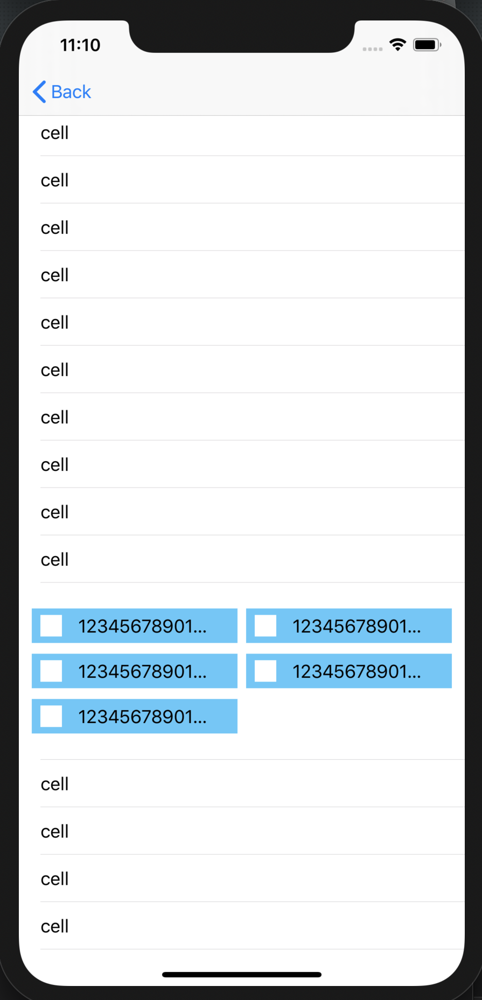

# gist-collectionview-in-tableviewcell
A demo for showing how to implement a full-content displayed UICollectionView in a UITableViewCell. The collection view shows an N-item with the equal width in a row.

## ScreenShot

## Referrence

[UICollectionView inside UITableviewCell Dynamic Height Based on UICollectionViewCell Height](https://medium.com/@rozan.ktm/uicollectionview-inside-uitableviewcell-dynamic-height-based-on-uicollectionviewcell-height-86b3257e85c6)
